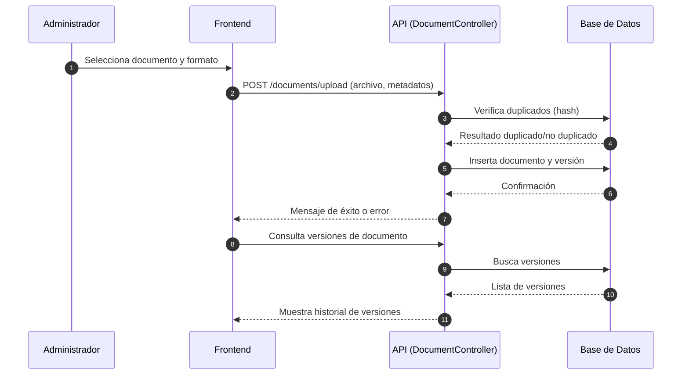

# HU-02: Carga y versionado de documentos

## Consideraciones previas

La presencia de usuarios, roles/permisos por categoría y categorías en el sistema afecta la carga y versionado de documentos de la siguiente manera:

1. **Usuarios:**  
   - Cada documento debe registrar quién lo sube (`uploaded_by`), lo que permite trazabilidad y auditoría.
   - Solo usuarios con permisos adecuados pueden cargar o versionar documentos, según su rol.

2. **Roles y Permisos por Categoría:**  
   - Los roles (admin, editor) son lo únicos con permisos para cargar, editar o ver documentos en cualquier categoría.
   - Los otros roles sólo podrán  ver documentos en categorías asignadas.
   - El versionado está restringido a los roles: admin, editor.

3. **Categorías:**  
   - Cada documento debe asociarse a una categoría (`category_id`), lo que facilita la organización y el filtrado.
   - Las categorías pueden tener jerarquía (padre-hijo), afectando la visibilidad y permisos de los documentos.
   - El versionado debe mantener la relación con la categoría original del documento.

En resumen, la carga y versionado de documentos depende de la correcta gestión de usuarios, roles/permisos y categorías, asegurando que solo usuarios autorizados puedan operar sobre documentos en las categorías permitidas y que toda acción quede registrada y asociada a los metadatos correspondientes.


## Pasos para implementar la carga y versionado de documentos

1. **Definir el modelo de documento y versiones**  
   - El modelo de documento (`documents`) incluye:
      - `id`: Identificador único
      - `title`: Título del documento
      - `slug`: Identificador legible
      - `category_id`: Relación con la tabla `document_categories`
      - `uploaded_by`: Usuario que sube el documento
      - `created_at`: Fecha de carga
      - `metadata`: Metadatos adicionales (JSONB)
   - El modelo de versiones (`document_versions`) incluye:
      - `id`: Identificador único
      - `document_id`: Relación con el documento
      - `version`: Número o nombre de versión
      - `model_id`: Relación con el modelo de embedding
      - `created_at`: Fecha de creación
      - `hash`: Hash para detectar duplicados

2. **Crear casos de uso en la capa de aplicación**  
   - Implementar casos de uso para carga de documentos, manejo de versiones y detección de duplicados.

3. **Desarrollar servicios de carga y versionado**  
   - Lógica para aceptar formatos PDF, DOCX, Markdown.
   - Generar hash del documento para evitar duplicados.
   - Registrar cada carga en `document_versions`.

4. **Configurar adaptadores y controladores**  
   - Endpoints: `/documents/upload`, `/documents/:id/versions`, `/documents`.
   - Validar usuario, formato y metadatos.

5. **Agregar middleware de validación y auditoría**  
   - Validar permisos de carga y edición.
   - Auditar cada carga y modificación.

6. **Gestionar mensajes de error y duplicados**  
   - Mensajes claros para duplicados, formatos no soportados y errores de carga.

7. **Auditoría y registro de eventos**  
   - Registrar cargas, versiones y detección de duplicados.

8. **Pruebas recomendadas**  
   - **Unitarias:** Validar lógica de carga, hash y versiones.
   - **Integración:** Verificar endpoints y relaciones entre tablas.
   - **E2E con Cypress:** Simular carga, manejo de versiones y detección de duplicados desde el frontend.
   - **Seguridad:** Validar permisos y protección de endpoints.
   - **Regresión:** Garantizar que nuevas funcionalidades no rompan el flujo de carga y versionado.

9. **Librerías necesarias**
   - `express`, `multer` (para manejo de archivos), `pg` o `sequelize`/`typeorm`, `bcrypt`, `jsonwebtoken`, `dotenv`, `cypress`, `jest` o `mocha/chai`.

10. **Estructura de directorios y archivos sugerida**

```text
modules/documents/
├── domain/
│   └── Documento.js
├── application/
│   ├── CargarDocumentoUseCase.js
│   ├── ManejarVersionesUseCase.js
│   └── DetectarDuplicadosUseCase.js
├── infrastructure/
│   ├── adapters/
│   │   ├── DocumentApiAdapter.js
│   │   └── DocumentRepositoryAdapter.js
│   ├── controllers/
│   │   └── DocumentController.js
│   ├── database/
│   │   └── schema.sql
│   └── routes.js
├── tests/
│   ├── unit/
│   │   └── document.test.js
│   ├── integration/
│   │   └── document.integration.test.js
├── cypress/
│   ├── e2e/
│   │   └── document.cy.js
│   └── support/
│       └── commands.js
├── README.md
```

11. **Descripción de cada archivo**
- `domain/Documento.js`: Entidad y lógica principal del documento.
- `application/CargarDocumentoUseCase.js`: Caso de uso para cargar documentos.
- `application/ManejarVersionesUseCase.js`: Caso de uso para manejar versiones.
- `application/DetectarDuplicadosUseCase.js`: Caso de uso para detectar duplicados.
- `infrastructure/adapters/DocumentApiAdapter.js`: Adaptador para integración externa.
- `infrastructure/adapters/DocumentRepositoryAdapter.js`: Adaptador para persistencia.
- `infrastructure/controllers/DocumentController.js`: Controlador REST para carga y versiones.
- `infrastructure/database/schema.sql`: Script de tablas (usar y adaptar los scripts de `/docs/BD/`).
- `infrastructure/routes.js`: Rutas y vinculación de controladores.
- `tests/unit/document.test.js`: Pruebas unitarias.
- `tests/integration/document.integration.test.js`: Pruebas de integración.
- `cypress/e2e/document.cy.js`: Pruebas E2E.
- `cypress/support/commands.js`: Comandos Cypress.
- `README.md`: Documentación del módulo.

---

12. **Diagrama de secuencia (Mermaid) para HU-02: Carga y versionado de documentos**



Este diagrama muestra el flujo principal de carga, detección de duplicados y manejo de versiones para HU-02.

13. **Orden y tareas a desarrollar**

1. **Diseño y migración de base de datos**
   - Adaptar y ejecutar scripts SQL para crear tablas (`documents`, `document_versions`, etc.).
   - Verificar integridad y relaciones.
2. **Implementación del modelo de dominio**
   - Crear entidad `Documento.js` y sus validaciones.
3. **Casos de uso en la capa de aplicación**
   - Desarrollar casos de uso: carga, manejo de versiones, detección de duplicados.
4. **Servicios de carga y versionado**
   - Implementar lógica para formatos y hash.
5. **Adaptadores y persistencia**
   - Crear adaptadores para API y base de datos.
6. **Controladores y rutas**
   - Desarrollar controlador y endpoints REST.
7. **Middleware de validación y auditoría**
   - Implementar y probar validaciones y auditoría.
8. **Gestión de errores y auditoría**
   - Configurar mensajes claros y registro de eventos.
9. **Pruebas unitarias, integración y E2E**
   - Desarrollar pruebas para lógica, endpoints y flujos completos.
10. **Documentación y ejemplos**
    - Completar README y agregar ejemplos de uso.
11. **Revisión y mejora continua**
    - Validar criterios de aceptación y optimizar según resultados de pruebas.
