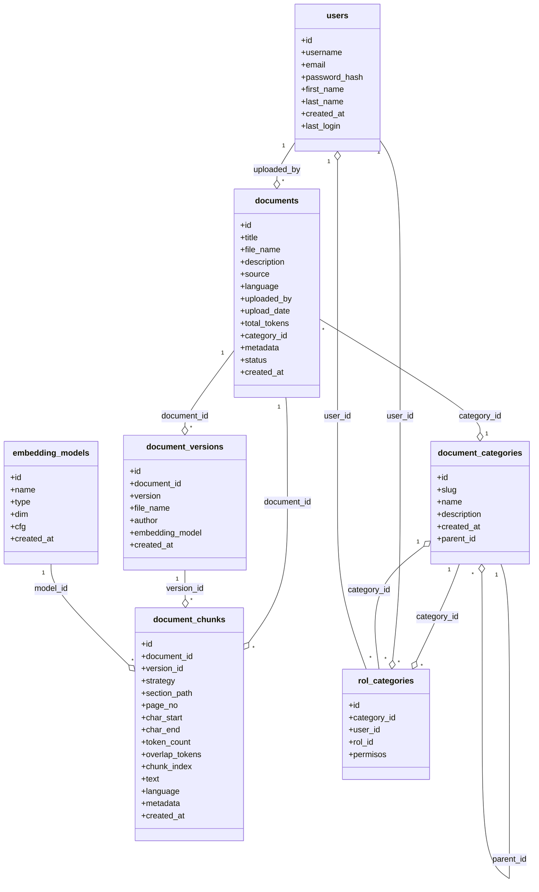

# Relaciones entre tablas principales para la gestión de documentos y usuarios en RAG Avanzado

- **documents**: Almacena los documentos principales.  
  - Relacionada con:  
    - `users` (campo `uploaded_by`): Indica quién subió el documento.  
    - `document_categories` (campo `category_id`): Clasifica el documento en una categoría.

- **document_categories**: Clasifica los documentos por categoría y permite jerarquías.  
  - Relacionada con:  
    - `documents` (campo `id`): Cada documento pertenece a una categoría.  
    - `document_categories` (campo `parent_id`): Permite categorías padre-hijo.  
    - `rol_categories` (campo `category_id`): Asocia roles de usuario a categorías para gestionar permisos.

- **document_versions**: Permite versiones históricas de cada documento.  
  - Relacionada con:  
    - `documents` (campo `document_id`): Cada versión pertenece a un documento.

- **document_chunks**: Fragmenta los documentos en partes para indexación y embeddings.  
  - Relacionada con:  
    - `documents` (campo `document_id`): Cada chunk pertenece a un documento.  
    - `document_versions` (campo `version_id`): Cada chunk puede pertenecer a una versión.

- **embedding_models**: Registra los modelos de embedding utilizados.  
  - Relacionada con:  
    - `chunk_embeddings` (campo `model_id`): Cada embedding de chunk referencia un modelo.

- **rol_categories**: Permite asociar roles de usuario a categorías específicas, gestionando permisos o accesos por categoría.  
  - Relacionada con:  
    - `document_categories` (campo `category_id`): Define los permisos por categoría.  
    - `users` (campo `user_id` o `rol_id`): Asocia usuarios o roles a categorías para control de acceso.

- **users**: Almacena la información de los usuarios del sistema.  
  - Relacionada con:  
    - `documents` (campo `uploaded_by`): Usuario que subió el documento.  
    - `rol_categories` (campo `user_id` o indirectamente por rol): Permite asociar usuarios o roles a categorías para definir permisos y accesos.

Estas tablas y relaciones permiten una gestión avanzada de documentos, incluyendo clasificación por categorías y roles, versiones, fragmentación (chunks) y embeddings, además de control de acceso y auditoría por usuario.

---

