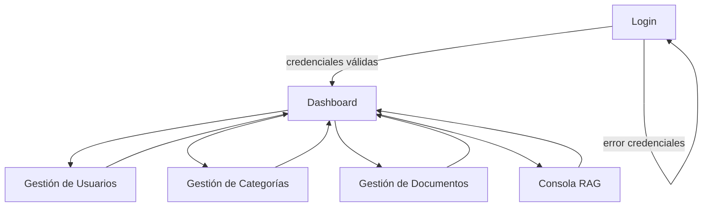

# Frontend RAG Avanzado - indInicDashBoard

Este documento define la estructura inicial del frontend para el RAG avanzado, utilizando **Node.js**, **Vue 3**, **LangChain** y librerías auxiliares (Pinia, Vue Router, TailwindCSS).

---

## 📂 Estructura de Workspace

```bash

├── package.json
├── vite.config.js
├── src/
│   ├── main.js              # Punto de entrada Vue
│   ├── App.vue              # Layout principal
│   ├── assets/              # Estilos e imágenes
│   ├── components/          # Componentes comunes (Navbar, Sidebar, Card, etc.)
│   ├── views/               # Vistas principales
│   │   ├── Login.vue
│   │   ├── Dashboard.vue
│   │   ├── Users.vue
│   │   ├── Categories.vue
│   │   ├── Documents.vue
│   │   ├── RAGConsole.vue   # Consola interactiva para pruebas RAG
│   ├── store/               # Pinia stores
│   │   ├── userStore.js
│   │   ├── ragStore.js
│   ├── router/              # Rutas de navegación
│   │   ├── index.js
│   ├── services/            # Integración con backend y LangChain
│   │   ├── api.js
│   │   ├── ragService.js
│   └── utils/               # Funciones auxiliares
│       ├── auth.js
│       ├── formatters.js
└── tests/                   # Pruebas unitarias y de integración
```

---

## 🔑 Flujo General de la Aplicación

- **Login**: validación de credenciales contra backend.
- **Dashboard**: acceso a módulos según rol del usuario.
- **Módulos principales**:
  - Gestión de **usuarios**.
  - Gestión de **categorías**.
  - Gestión de **documentos**.
  - Consola **RAG** para interacción con LLM + embeddings.

1. **Login / Autenticación**
   - Usuario inicia sesión → `auth/store.js` maneja token y estado global.
   - Guardias de rutas aseguran acceso según rol (`admin`, `editor`, `user`).

2. **Dashboard (Home)**
   - Panel principal con acceso a: *Usuarios, Categorías, Documentos, RAG Queries*.

3. **Módulo RAG**
   - Vista para hacer consultas (`rag/views/QueryView.vue`).
   - Consume API del backend LangChain para:
     - Ingestión / indexación (modo admin).
     - Retrieval + generación de respuestas (modo usuario).

4. **Gestión de Usuarios y Categorías**
   - CRUD con servicios conectados a API REST del backend.

---

## 🛠️ Tecnologías Principales

- **Vue 3 + Vite** → Front rápido y modular.
- **Pinia** → Manejo de estado global.
- **TailwindCSS** → Estilos consistentes y ágiles.
- **LangChain.js** → Conexión con el motor RAG.
- **Axios / Fetch API** → Comunicación con backend.
- **Jest / Vitest** → Pruebas.

---

## ✅ Próximos Pasos

1. Crear proyecto base con `npm create vite@latest rag-frontend`.
2. Instalar dependencias:
   ```bash
   npm install vue-router pinia axios tailwindcss langchain
   ```
3. Configurar rutas iniciales: `/login`, `/dashboard`, `/users`, `/categories`, `/documents`, `/rag`.
4. Implementar autenticación contra el backend.
---

## 📊 Diagrama de Navegación (Mermaid)



---

## 🚀 Futuras Extensiones

- Autenticación con JWT y refresh tokens.
- Integración de streaming de respuestas del modelo en **RAGConsole**.
- Módulo de auditoría y métricas de uso.
- Internacionalización (i18n).
